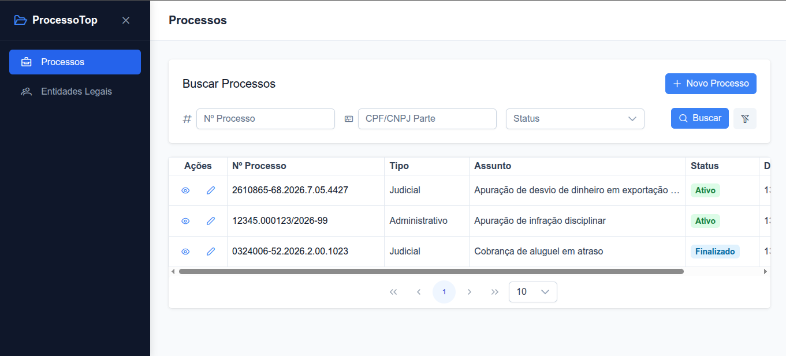
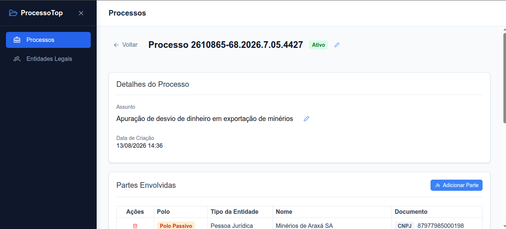
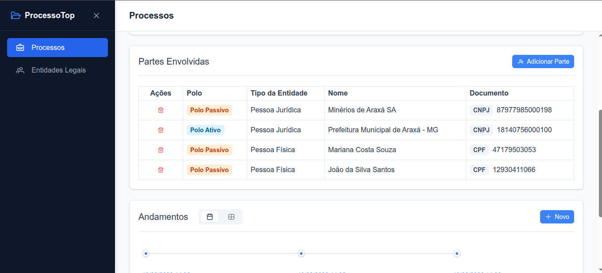
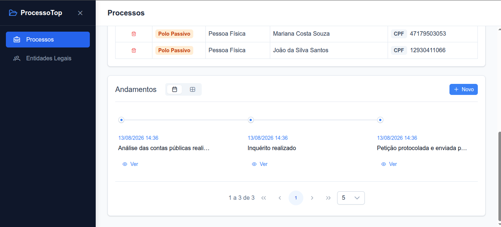
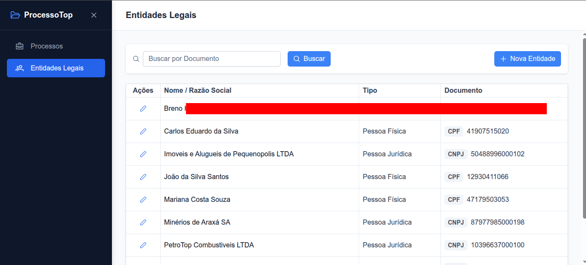

# desafio-integrativa

Este projeto é um desafio técnico para a Integrativa.

Link: **[processotop.pelegrinlab.lat](https://processotop.pelegrinlab.lat)**

O repositório contém um sistema simples, chamado de **ProcessoTop**, que permite gerenciar processos judiciais e administrativos, além de registrar e vincular as partes envolvidas (pessoas físicas ou jurídicas).

## Estrutura do projeto

O código está dividido claramente entre frontend e backend:

- **[Backend](./backend/README.md)**: Aplicação em .NET 10.0, seguindo os princípios de Clean Architecture e utilizando PostgreSQL.
- **[Frontend](./frontend/README.md)**: Aplicação em Angular 20, usando a biblioteca de componentes PrimeNG.

## Como rodar localmente

A forma mais fácil de rodar tudo junto é via Docker, usando o `docker-compose.dev.yml` que já inclui o Traefik como proxy, o banco de dados e os serviços.

1. Na raiz do projeto, configure as variáveis no `.env.dev`. Você pode só copiar as variáveis do `.env.template` e irá funcionar normalmente.
2. Suba os containers:
   ```bash
   docker compose -f docker-compose.dev.yml up --build -d
   ```
3. Acesse o projeto:
   Pelo Traefik (Proxy):
   - **Frontend**: http://localhost:8087
   - **API (Swagger)**: http://api.localhost:8087/swagger
   - **Dashboard Traefik**: http://localhost:8080

   Conexão direta aos containers para desenvolvimento:
   - **Frontend**: http://localhost:4200
   - **API (Backend)**: http://localhost:8000
   - **Swagger (Documentação)**: http://localhost:8000/swagger
   - **PostgreSQL**: localhost:5432

## Diferenças entre Ambientes (Dev vs Prod)

A exposição dos containers muda dependendo do ambiente escolhido:

- **Desenvolvimento (`dev`)**: Todos os containers (banco, API e frontend) expõem suas portas nativas diretamente para o host (ex: `5432`, `8000`, `4200`). Isso agiliza o processo de desenvolvimento e debug. O dashboard do Traefik também fica disponível.
- **Produção (`prod`)**: Focado em segurança, nenhum container interno expõe portas para a máquina. Apenas o Traefik fica acessível e atua como porta de entrada única. O dashboard de administração do Traefik fica desabilitado.

> **Nota:** Em ambos os cenários, a comunicação entre as aplicações (ex: API acessando o Banco) acontece exclusivamente de forma segura através das redes internas do Docker.

## Deploy

O projeto já está configurado e rodando em produção através de:
- Tunnel da Cloudflare para não expor os containers na internet
- Proxy Traefik respondendo pelo domínio
- Deploy dos contâineres no Komodo em uma máquina da Oracle Cloud

Link: **[processotop.pelegrinlab.lat](https://processotop.pelegrinlab.lat)**

## Telas


*Lista principal de processos com filtros e paginação.*


*Visão geral dos detalhes de um processo específico.*


*Gerenciamento das partes envolvidas (polos ativo e passivo).*


*Linha do tempo e registros de andamentos do processo.*


*Listagem e cadastro de Entidades Legais (Pessoas Físicas e Jurídicas).*